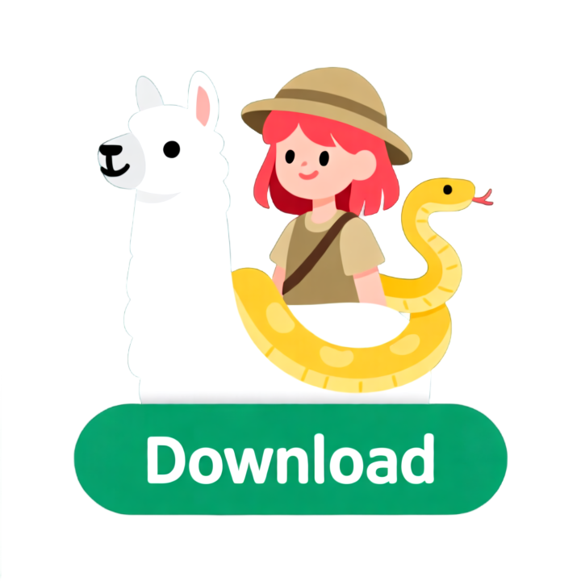

  

## Try Now
A .exe executable to try the project easy.

Click the image to go to the Releases page and download the executable:

  

## ¿Dreaming to create a ChatBot using Ren'py as your UI?

This ren'py project is a functional concept of how using ren'py connected to ollama.cpp could bring a nice full local Chatbot, this repo provides a project of renpy to customize it and the project build.

##  Set up

###  Option A:
¿Is posible to release the binaries on the release version
1. Download only the releases .zip, they are on the Releases section in the right. Download only the one of your SO (Only tested on Windows)
2. Download ollama and install
3. Look for the folder where ollama was installed, copy and paste the content on game/bin
If done properly:

4. Start the .exe
5. Start the game, and YOU GOT IT

### Option B:
1. Download this project and move to your folder where the other renpy projects are stored or create a new one and overwrite it with this one (Other way is only changing the scrypt.rpy file)
   To download you can go to the button Code-> Download Zip or use git.
2. Download ollama and install
If done properly:

3. Launch the project in Ren'py
4. Start the game, and YOU GOT IT

   
## Important settings

### Choosing model: 

This project is using  gemma3:1b, provides good performance for 'low' system requirements, but you can pick other model. Remember to change the 8 line on scrypt.rpy with the name of the model

## I have all set up ¿How I run it?

You are ready to go

## Results

## Performace

Is quite good (5 seconds to generate)

Test de context limit, on what extent is a problem and find opctions to expand it 

If the context is a problem implement a function to refresh de model

## Customaization 

There is a base prompt to improve the answers of the MC, it is stored on hidden_prompt.txt and can be modified, the default is focused on make the responses more role-play. It is implemented on hidden_prompt.py

Also you can add character background on personality.txt. it adds to the base_prompt

You can do some settings on the output tokens and choose your model on the scrypt.rpy

## Tips and Tricks

-Use auto to avoid spamming clicks to know when the response has been served

-Put the auto setting bar below mid to get a more fluid conversation

-Put the auto setting bar below mid to get a more fluid conversation

## ¿Future updates?

-Auto download and extract ollama if necesary

-Implemenmt qwen on the release version

-Crear ramas: Con binario y sin binario

-Opción con binarios de ollama y sin

-Opción de usar los modelos del sistema y de fuera

-Dejar comentado la opción de usar 

-Improve performance 

-Check typos and grammar

-Create a development journal

-Create a icon for the program and the repo

-Add the chance to input personality to the prompts

-Explain that is not necesary to use ollam via cmd

-Add a diaologue function for multiple characters controlled by the model talk between them ¿Other repo?

-¿Create a default personality and look for our MC?

-TTS?

-Do some cleaning on the Files 

-Display the 1.0 version on the Ren'py  and itch.io forum ¿Also on Reddit?

-Add some style to the program (It's pretty rough):
Image for the girl
Not use the default UI
Beutify the menu

-More comments on the code

-Upgrading this Wiki, after more testing

-Integrate transformers or ollama on the renpy project to have a stand alone build to use locally

-Add more AI tools (This one is greedy)

-Better response time **Done** **0.2** (Is explained on tips and tricks)

-Program that if the response is too big for the dialogue box, put it on the next dialogue box (Feaseable) **Done** **0.2**

-Translating text on the screenshoots to English and some text that is not in English **Done** **0.2**

-Specify the LICENSE **Done** **0.3**

-Start Ollama via code **Done** **0.3**

-¿Themed background? **0.3**

-Start Ollama via code on python **0.3**

-¿Logo for the repo? **0.3**

-put on other .py the ollama part to improve readibilty **0.3**

-Digging into settings of the ollama side of the code  **0.4**

-Integrate ollama binaries on the renpy project to have a stand alone build to use locally **0.4**

## Trouble shoothing

-Waiting Feedback!!!!

##  Resources:

This project is based in Ren'py as the UI and graphic engine

https://www.renpy.org/

And requires the use of Ollama to serve and process the prompts

https://ollama.com/

Huge thanks to the qwen team for their amazing fully open source and open wights model

LLM: qwen2:7b

https://ollama.com/library/qwen2:7b

Image model: Qwen-Image-GGUF

https://huggingface.co/city96/Qwen-Image-gguf/tree/main

    ComfyUI workflow:

https://docs.comfy.org/tutorials/image/qwen/qwen-image

Lora: Qwen-Image-Lightning

https://huggingface.co/lightx2v/Qwen-Image-Lightning/tree/main

Ace-step are leading the open source ai music generation

Music: Ace-Step 3.5B

https://github.com/ace-step/ACE-Step

Generations Tools:

ComfyUI:

https://www.comfy.org/

Gemma3:1b is only  a option between other great models lbut is a good  for it's efficiency, conversational skills and SFW parameters. Its adviced that is not allowed to distribute gemma3:1b without Google consent, beacause its weights are clouse source. I will explore in the future other altervatives that allows to be shipped in the game files.

https://huggingface.co/google/gemma-3-1b-it

##  Related Projects:

https://github.com/Calandiel/llama-renpy/blob/master/script.rpy