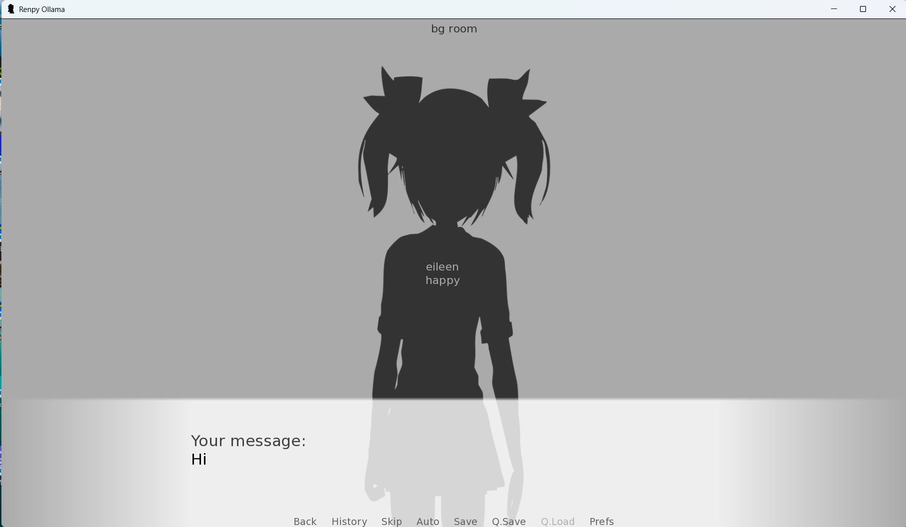
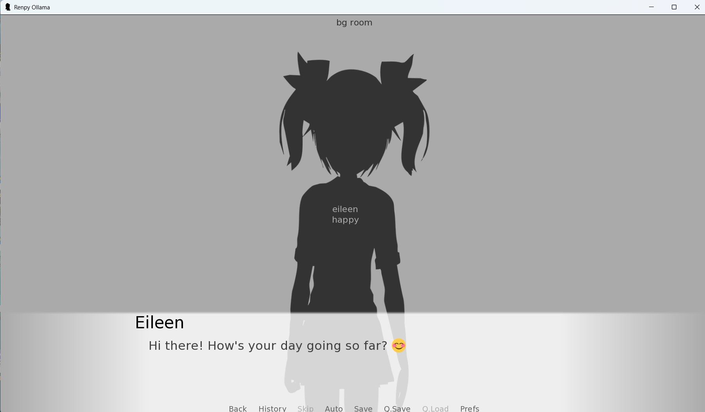

  

## ¿Dreaming to create a ChatBot using Ren'py as your UI?

This ren'py project is a functional concept of how using ren'py connected to ollama.cpp could bring a nice full local Chatbot, this repo provides a project of renpy to customize it and the project build.

##  Set up

###  Option A:
1. Download only the releases .zip, they are on the Releases section in the right. Download only the one of your SO (Only tested on Windows)
2. Download ollama and download gemma3:1b via ollama
If done properly:

3. Run Ollama 
4. Start the .exe
5. Start the game, and YOU GOT IT

### Option B:
1. Download this project and move to your folder where the other renpy projects are stored or create a new one and overwrite it with this one (Other way is only changing the scrypt.rpy file)
   To download you can go to the button Code-> Download Zip or use git.
3. Download ollama and download gemma3:1b via ollama
If done properly:

4. Run the model on Ollama 
5. Launch the project in Ren'py
6. Start the game, and YOU GOT IT
   
## Important settings

### Choosing model: 

This project is using  gemma3:1b, provides good performance for 'low' system requirements, but you can pick other model. Remember to change the 8 line on scrypt.rpy with the name of the model

## I have all set up ¿How I run it?

You have to start ollama.exe (If you don't have config to boot on start)

Use cmd to run the model (Example: ollama run gemma3:1b)

The run the renpy project

## Results

## Customaization 

You can add a 'base prompt' by addig the tokens via code on scrypt.rpy it can give you:
* Personality for your character
* Limit the number of words of the response (It is already implemented to fit in the chatter box)

You can do some settings on the output tokens and choose your model on the scrypt.rpy

## Tips and Tricks

-Use auto to avoid spaming clicks to know when the response has been served
-Put the auto setting bar below mid to get a more fluid conversation

## ¿Future updates?

-Check typos and grammar

-Create a development journal

-Merge v0.2

-Digging into settings of the ollama side of the code

-put on other .py the ollama part to improve readibilty

-Create a icon for the program and the repo

-Add the chance to input personality to the prompts

-Explain that is not necesary to use ollam via cmd

-Add a diaologue function for multiple characters controlled by the model talk between them ¿Other repo?

-¿Logo for the repo?

-¿Create a default personality and look for our MC?

-¿Themed background?

-TTS?

-Do some cleaning on the Files 

-Display the 1.0 version on the Ren'py forum ¿Also on Reddit?

-Add some style to the program (It's pretty rough):
Image for the girl
Not use the default UI
Beutify the menu

-More comments on the code

-Upgrading this Wiki, after more testing

-Integrate transformers or ollama on the renpy project to have a stand alone build to use locally

-Add more AI tools (This one is greedy)

-Better response time **Done** **0.2** (Is explained on tips and tricks)

-Program that if the response is too big for the dialogue box, put it on the next dialogue box (Feaseable) **Done** **0.2**

-Translating text on the screenshoots to English and some text that is not in English **Done** **0.2**

-Specify the LICENSE **Done** **0.3**

## Trouble shoothing

-Waiting Feedback!!!!

##  Resources:

This project is based in Ren'py as the UI and graphic engine

https://www.renpy.org/

And requires the use of Ollama to serve and process the prompts

https://ollama.com/

Gemma3:1b is only  a option between other great models lbut is a good  for it's efficiency, conversational skills and SFW parameters. Its adviced that is not allowed to distribute gemma3:1b without Google consent, beacause its weights are clouse source. I will explore in the future other altervatives that allows to be shipped in the game files.

https://huggingface.co/google/gemma-3-1b-it

##  Related Projects:

https://github.com/Calandiel/llama-renpy/blob/master/script.rpy

